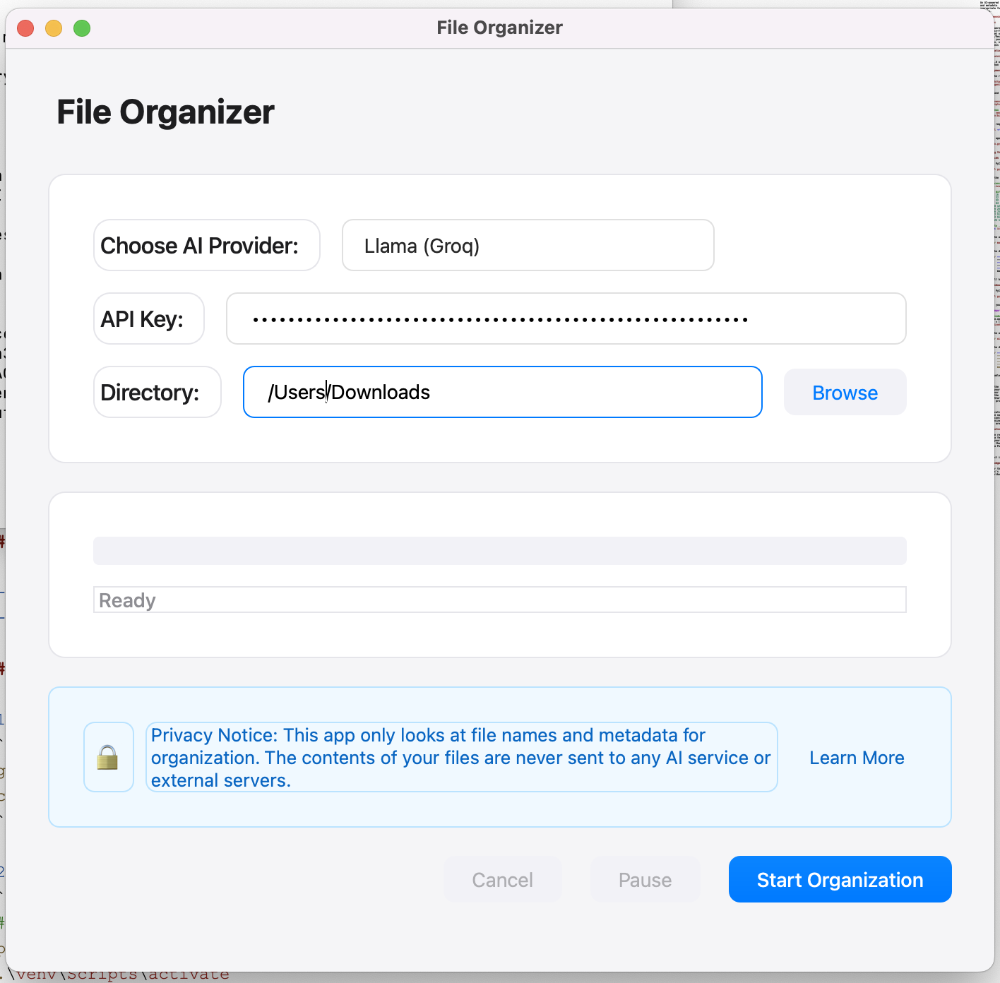

# AI File Organizer

An AI-powered desktop application that helps organize files in any directory using file names and metadata. The app uses AI (Claude, GPT-4, or Groq) to intelligently categorize files into appropriate folders while ensuring your privacy - no file contents are ever sent to external servers.



## Features

- 🤖 AI-powered file organization using various providers (Claude, GPT-4, Groq)
- 🔒 Privacy-focused: Only uses file names and metadata, never reads file contents
- 📁 Creates organized category folders automatically
- ⏸️ Pause/Resume functionality
- 💾 Saves your preferences
- 🎨 Modern, native UI design
- 🔄 Progress tracking with detailed status updates

## Installation

### Prerequisites

- Python 3.8 or higher
- pip (Python package installer)

### Development Setup

1. Clone the repository:
```bash
git clone https://github.com/yourusername/file-organizer.git
cd file-organizer
```

2. Create and activate a virtual environment:
```bash
# Windows
python -m venv venv
.\venv\Scripts\activate

# macOS/Linux
python3 -m venv venv
source venv/bin/activate
```

3. Install required packages:
```bash
pip install -r requirements.txt
```

4. Run the application:
```bash
python3 main.py
```

## Building the Application

### For macOS

1. Install PyInstaller:
```bash
pip install pyinstaller
```

2. Create the icon set:
```bash
# Create iconset directory
mkdir icon.iconset

# Generate different sizes
sips -z 16 16     icon.png --out icon.iconset/icon_16x16.png
sips -z 32 32     icon.png --out icon.iconset/icon_16x16@2x.png
sips -z 32 32     icon.png --out icon.iconset/icon_32x32.png
sips -z 64 64     icon.png --out icon.iconset/icon_32x32@2x.png
sips -z 128 128   icon.png --out icon.iconset/icon_128x128.png
sips -z 256 256   icon.png --out icon.iconset/icon_128x128@2x.png
sips -z 256 256   icon.png --out icon.iconset/icon_256x256.png
sips -z 512 512   icon.png --out icon.iconset/icon_256x256@2x.png
sips -z 512 512   icon.png --out icon.iconset/icon_512x512.png
sips -z 1024 1024 icon.png --out icon.iconset/icon_512x512@2x.png

# Convert to .icns
iconutil -c icns icon.iconset
```

3. Build the application using the spec file:
```bash
pyinstaller macos_file_organizer.spec
```

or using the direct command:
```bash
pyinstaller --name "FileOrganizer" \
            --icon "assets/icon.icns" \
            --windowed \
            --onefile \
            --add-data "assets/*:assets" \
            main.py
```

The app will be available in the `dist` folder.

### For Windows

1. Install PyInstaller:
```bash
pip install pyinstaller
```

2. Convert your icon to .ico format:
```python
from PIL import Image

# Create Windows icon
img = Image.open('icon.png')
icon_sizes = [(16,16), (32,32), (48,48), (64,64), (128,128), (256,256)]
img.save('icon.ico', sizes=icon_sizes)
```

3. Build the application using the spec file:
```bash
pyinstaller windows_file_organizer.spec
```

or using the direct command:
```bash
pyinstaller --name "FileOrganizer" ^
            --icon "assets/icon.ico" ^
            --windowed ^
            --onefile ^
            --add-data "assets/*;assets" ^
            main.py
```

The executable will be available in the `dist` folder.

## Usage

1. Launch the application
2. Select your preferred AI provider (Claude, GPT-4, or Groq)
3. Enter your API key for the selected provider
4. Choose the directory you want to organize
5. Click "Start Organization"
6. Monitor progress and use pause/cancel if needed

## Privacy

This application is designed with privacy in mind:
- Only file names and metadata are processed
- No file contents are ever read or transmitted
- All organization happens locally on your computer
- API keys are stored securely in local configuration

## Contributing

1. Fork the repository
2. Create a feature branch
3. Commit your changes
4. Push to the branch
5. Create a Pull Request

## License

This project is licensed under the MIT License - see the [LICENSE](LICENSE) file for details.

## Acknowledgments

- PyQt6 for the GUI framework
- Anthropic's Claude, OpenAI's GPT-4, and Groq for AI capabilities
- All contributors and users of this project